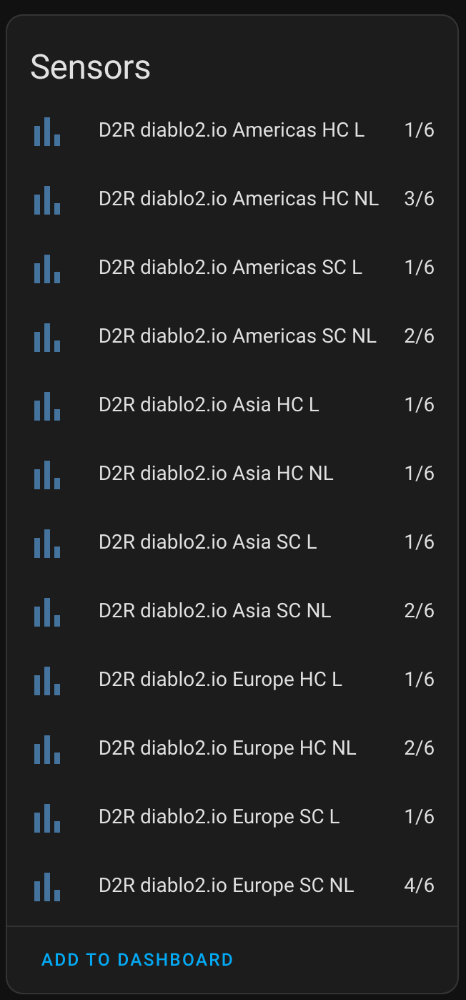

# D2R Tracker

This is a [Home Assistant]() custom component used for tracking [Diablo Clone events](https://diablo.fandom.com/wiki/%C3%9Cber_Diablo) in the game [Diablo 2 Resurrected](https://diablo2.blizzard.com/en-us/).

The custom component instantiates sensors in Home Assistant that track the progress of the Diablo Clone event in each region, ladder/non-ladder, softcore/hardcore realms:

  

Diablo Clone will walk the earth once the counter reaches `6/6`.

## Data Origin
The event progress is crowdsourced in Discord and polled from one of the two APIs (generously made publicly available) every few minutes.

### diablo2.io
Make sure to read through their [fair usage policy](https://diablo2.io/forums/diablo-clone-uber-diablo-tracker-public-api-t906872.html) before using this integration. No API key is required at the time of writing - just leave it empty whe setting up the integration.

### d2runewizard.com
Make sure to read through their [fair usage poliicy](https://d2runewizard.com/integration) before using this integration. The API key is optional for the DClone Tracker endpoint, but in practice requests may be throttled without one.

## Installation
### Manual
Copy the `custom_components/d2r_tracker` directory into your Home Assistant's `config/custom_components/` directory.

### With HACS
See [Custom Repositories](https://hacs.xyz/docs/faq/custom_repositories/) in the HACS docs.

## Developing
This repository is based on the [ludeeus/integration_blueprint](https://github.com/ludeeus/integration_blueprint) template. To develop, open this repository inside a dev container in VSCode and run `scripts/develop`.

This will spin up a Home Assistant instance and make the `d2r_tracker` custom componnent available in it.