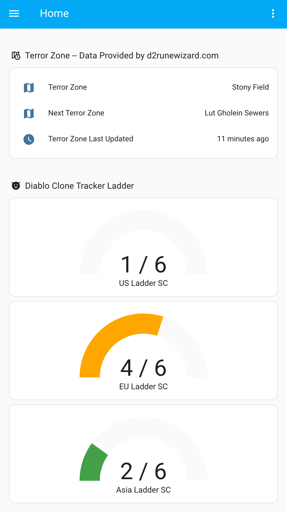

# D2R Tracker

A [Home Assistant](https://home-assistant.io) integration for tracking [Diablo 2 Resurrected](https://diablo2.blizzard.com/en-us/) in-game events.

Installing this integration will make the following sensors available in Home Assistant:
- Current and next [Terror Zones](https://diablo.fandom.com/wiki/Terror_Zone)
- [Uber Diablo / Diablo Clone](https://diablo.fandom.com/wiki/%C3%9Cber_Diablo) progress tracker, per region, ladder/non-ladder and hardcore/softcore

  

Diablo Clone will walk the earth once the counter reaches `6/6`.

## Data Providers
The data is polled from APIs genernously provided by the community. Make sure to read through their policies (linked below) before using this integration. You can choose between these providers during setup.

| Provider | Current Terror Zone? | Next Terror Zone? | DClone Progress? | Getting Access |
|----------|----------------------|-------------------|------------------|--------|
| [d2runewizard.com](https://d2runewizard.com) | ✅ | ✅ | ✅ | [Fair use policy and getting an API key](https://d2runewizard.com/integration) |
| [diablo2.io](https://diablo2.io) | 🚫 | 🚫 | ✅ | [Fair use policy](https://diablo2.io/forums/diablo-clone-uber-diablo-tracker-public-api-t906872.html) |

## Installation
### Manual
Copy the `custom_components/d2r_tracker` directory into your Home Assistant's `config/custom_components/` directory.

### With HACS
See [Custom Repositories](https://hacs.xyz/docs/faq/custom_repositories/) in the HACS docs.

## Developing
This repository is based on the [ludeeus/integration_blueprint](https://github.com/ludeeus/integration_blueprint) template. To develop, open this repository inside a dev container in VSCode and run `scripts/develop`.

This will spin up a Home Assistant instance and make the `d2r_tracker` custom componnent available in it.
